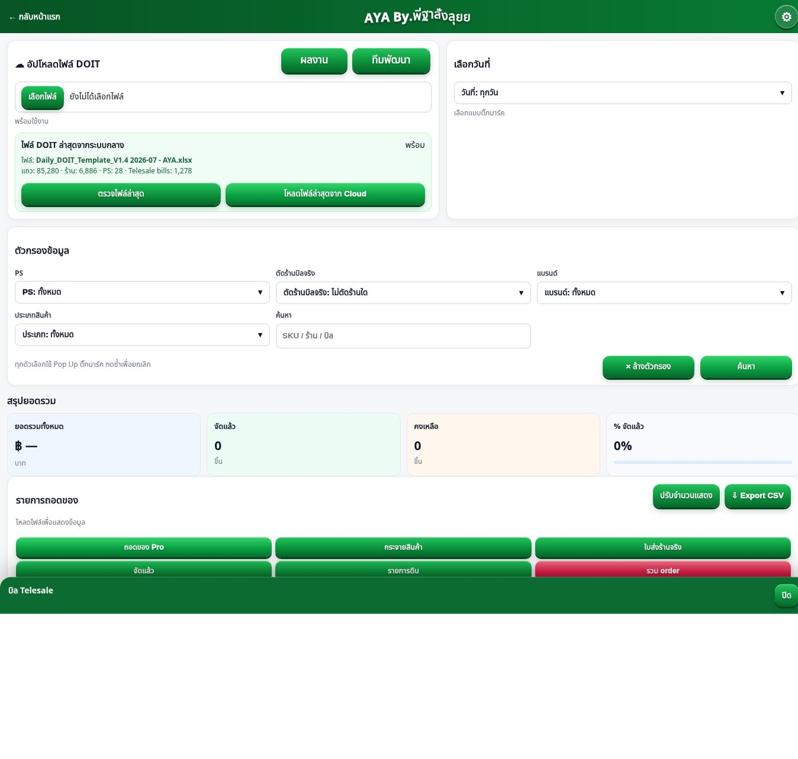

# Pro Single Source — Baseline

Base commit: `367d17c6ca40bd9cdbe034fdde3dac50c67d9212`

Branch: `codex/pro-single-source-refactor`

This report records the active `/pro.html?t=1028` runtime before the refactor. It is based on the current `main` source and a read-only browser run against the production URL on 23 July 2026.

## Active runtime chain

The page currently crosses six logical layers before all behavior is installed:

1. `dist/pro.html` fetches `/pro-shell-v1028.html`, removes and injects text with regular expressions, then replaces the document with `document.open/write/close`.
2. `dist/pro-shell-v1028.html` supplies the real HTML, inline CSS, XLSX vendor script, inline team-photo globals, `pro-team-single.js`, and `pro-core-v4.js`.
3. `dist/assets/pro-core-v4.js` injects print CSS, loads `pro-results-mode.js`, then dynamically appends the remaining scripts in sequence.
4. `dist/assets/pro-native-core.js` owns the main closure state and performs the normal render.
5. `dist/assets/pro-native-core-overrides.js` waits for the core, watches DOM mutations, intercepts events, and changes behavior after the normal render.
6. The print path is intercepted or restyled again by `pro-print-store-bills.js`, `pro-print-mode-fixes.js`, `pro-print-column-widths.js`, and `pro-print-a4-pro-fix.js`.

The browser observed this JavaScript order:

```text
/assets/vendor/xlsx-0.18.5.full.min.js
[inline team-photo code]
/assets/pro-team-single.js?v=3
/assets/pro-core-v4.js?v=358
/assets/pro-results-mode.js?v=1028-native
/assets/pro-print-store-bills.js?v=1027
/assets/pro-native-core.js?v=1028-native
/assets/pro-native-core-overrides.js?v=1028-native
/assets/pro-print-mode-fixes.js?v=1027
/assets/pro-print-column-widths.js?v=1027
/assets/pro-print-a4-pro-fix.js?v=1027
```

## Duplicate or later-modified behavior

| Behavior | First owner | Later layer |
|---|---|---|
| Main state and render | `pro-native-core.js` | Override reads state and repairs rendered DOM |
| Enter/Next | Core input change rerenders | Override captures key/change and refocuses after 140 ms |
| Done table | Core `renderMode()` | Override calls print module to replace the table after 80 ms |
| Order total | Core renders order rows | Override scans the DOM and appends a total row after render |
| Telesale total | Core renders Telesale pages | Override scans each bill DOM and appends totals |
| Developer modal | Inline shell globals, then `pro-team-single.js` | Override wraps `window.openDevTeamModal` |
| Pick-mode print | Core has `printPick()` | `pro-print-store-bills.js` captures the click first |
| Other print modes | Core has `printPrep()` | `pro-print-mode-fixes.js` captures the click first |
| Print layout | Core injects print CSS | Three later print CSS/fix files modify it |

Duplicated function names across active files include `activeModeLabel`, `insertedGroups`, `mapVal`, `openPrint`, `parseKey`, `scopeOk`, `sourceRows`, `tableHeadsFromDom`, `tableRowsFromDom`, and `thaiDate`. Four files declare an `install()` function.

## State and persistence

The main mutable state is inside the `pro-native-core.js` closure:

```text
rows, active, key, q, page, pageSize, mode, showDetails, bound,
pickKind, tmp, remainView, telePage, sel, send, add, pull, ins,
hist, redoStack
```

The main LocalStorage record is `doit-core-unified-v1:<active-key>`. The print module also owns `doit-pro-print-price-edits-v1` and contains a fallback that independently scans all `doit-core-unified-v1:` records. Team/QR code reads `doit-dev-qr-config-v1` and `doit-team-photo-<person>-dataurl`.

This means the core state has one primary closure owner, but print and override layers still derive or recover state independently from globals, LocalStorage, and rendered DOM.

## Network requests on the active path

Read-only requests used by the page are:

```text
GET /pro-shell-v1028.html
GET /assets/vendor/xlsx-0.18.5.full.min.js
GET /assets/pro-team-single.js
GET /assets/pro-core-v4.js
GET /assets/pro-results-mode.js
GET /assets/pro-print.css
GET /assets/pro-print-store-bills.js
GET /assets/pro-native-core.js
GET /assets/pro-native-core-overrides.js
GET /assets/pro-print-mode-fixes.js
GET /assets/pro-print-column-widths.js
GET /assets/pro-print-a4-pro-fix.js
GET https://saodmeoilixfdqentofp.supabase.co/functions/v1/doit-active?mode=meta
GET https://saodmeoilixfdqentofp.supabase.co/functions/v1/doit-active?mode=data
GET https://saodmeoilixfdqentofp.supabase.co/functions/v1/dev-qr?action=config
GET https://saodmeoilixfdqentofp.supabase.co/functions/v1/dev-qr?action=image
GET https://saodmeoilixfdqentofp.supabase.co/functions/v1/team-photo/<person>
GET https://saodmeoilixfdqentofp.supabase.co/storage/v1/object/public/doit-files/team/<file>
```

The `mode=data` request and its returned `json_url`, when present, are only used after the user clicks Cloud load. No write request was used during baseline testing.

## Globals on the active path

```text
DOIT_PRO_CORE_BOOT
DOIT_CORE_APP
DOIT_JSON_APP
DOIT_NATIVE_CORE_PREVIEW
DOIT_PRO_PRINT_STORE_BILLS
loadTeamPhotos
openDevTeamModal
__doitCoreRows
__DOIT_PRO_RESULTS_BUTTON_V2__
__DOIT_PRO_PRINT_STORE_BILLS__
__DOIT_PRO_NATIVE_OVERRIDES__
__DOIT_PRO_PRINT_MODE_FIXES__
__DOIT_PRO_PRINT_COLUMN_WIDTHS__
__DOIT_PRO_A4_PRINT_FIX__
__PRO_TEAM_SINGLE_LOADER__
__PRO_TEAM_QR_SINGLE__
```

## Source, patch, and inactive files

- Real active core: `pro-native-core.js`.
- Active loaders: `pro.html`, `pro-core-v4.js`.
- Active behavior patches: `pro-native-core-overrides.js`, `pro-print-store-bills.js`, `pro-print-mode-fixes.js`.
- Active style patches: `pro-print-column-widths.js`, `pro-print-a4-pro-fix.js`.
- Active UI injectors: `pro-results-mode.js`, `pro-team-single.js`, plus inline shell code.
- Not loaded by the production Pro route: all other `dist/assets/pro-*.js` files. Some are still referenced by preview/test pages or old documentation and therefore cannot be deleted without a separate reference audit.

## Baseline evidence



Automated baseline results:

```text
npm run smoke: pass
npm run verify: pass
npm run test:pro-lazy: pass
node scripts/test-pro-regression.mjs: pass
```

The regression fixture locks filtering, grouping, sent/remaining quantities, raw/net/VAT totals, Telesale totals, send-only print quantity, zero-quantity exclusion, 12 rows per bill, and two bills per A4.
