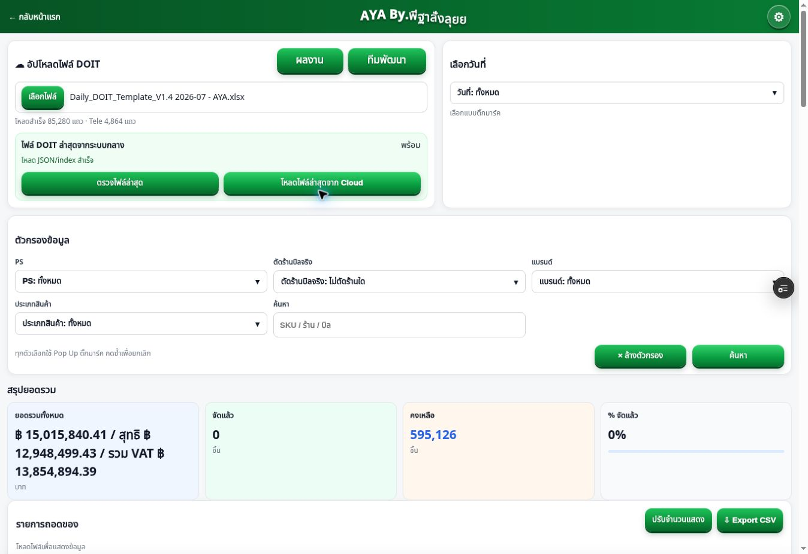
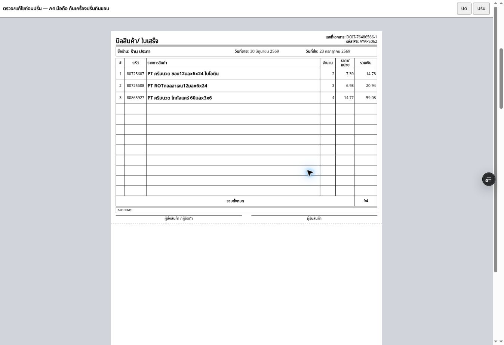

# Pro Single Source Refactor — Final Report

วันที่ตรวจ: 23 กรกฎาคม 2026

ฐานที่ใช้เริ่มงาน: `367d17c6ca40bd9cdbe034fdde3dac50c67d9212`

Branch: `codex/pro-single-source-refactor`

Draft PR: <https://github.com/proweed001-ux/solomon-doit-appV2/pull/64>

Preview ที่ใช้ QA โค้ด: <https://solomon-doit-app-v2-fdrb9uzk9-proweed-s-projects.vercel.app/pro.html?t=1028>

โค้ด commit ที่ใช้ QA บน Preview: `6c485cd5609bd4280e52223ba2007d541c044572`

## สรุปแบบภาษาชาวบ้าน

ก่อนแก้ หน้า Pro ทำงานผ่าน 6 ชั้น:

1. `pro.html` โหลดหน้า shell เก่า
2. แก้ข้อความ HTML ด้วย Regular Expression
3. เขียนทั้งหน้ากลับด้วย `document.open/write/close`
4. `pro-core-v4.js` สร้าง `<script>` เพื่อโหลดไฟล์อื่นต่อกัน
5. Core แสดงหน้าและถือ State
6. Override กับไฟล์แก้ปริ้นหลายไฟล์รอหน้าแสดงแล้วค่อยเข้าไปเปลี่ยนอีกครั้ง

หลังแก้ เหลือ 1 Render pipeline:

```text
/pro.html
  -> /assets/pro/app.js
      -> โมดูลตามหน้าที่
      -> State Store เดียว
      -> Core render ปกติ
```

หน้า HTML มี Script entry ของระบบ Pro เพียงจุดเดียว:

```html
<script type="module" src="/assets/pro/app.js"></script>
```

`app.js` import โมดูลโดยตรงตาม dependency ปกติ ไม่มี Dynamic Script Loader และไม่มีไฟล์ใดรอ Core แล้วค่อยแปะพฤติกรรมภายหลัง

## เจ้าของโค้ดใหม่

| หน้าที่ | เจ้าของ |
|---|---|
| จุดเริ่มระบบ | `dist/assets/pro/app.js` |
| โครงหน้า HTML | `dist/pro.html` |
| State, Undo/Redo snapshot, LocalStorage | `dist/assets/pro/state.js` |
| Render flow และ event binding | `dist/assets/pro/core.js` |
| อ่าน Cloud | `dist/assets/pro/data-source.js` |
| แปลงข้อมูล DOIT/Cloud เป็นรูปกลาง | `dist/assets/pro/parser-adapter.js` |
| กรองและรวมกลุ่ม | `dist/assets/pro/filters.js` |
| ส่งร้านนี้และ Enter/Next | `dist/assets/pro/send-store.js` |
| รวม Order | `dist/assets/pro/order.js` |
| Telesale | `dist/assets/pro/telesale.js` |
| จัดแล้ว | `dist/assets/pro/done.js` |
| สร้างข้อมูลบิลปริ้น | `dist/assets/pro/print-model.js` |
| แสดง/จัดหน้า/สั่งปริ้น | `dist/assets/pro/print.js` |
| Developer QR | `dist/assets/pro/developer-qr.js` |
| ทีมพัฒนา | `dist/assets/pro/team.js` |
| ปุ่ม Fuel แบบซ่อน | `dist/assets/pro/fuel-secret.js` |
| โหมดผลงาน | `dist/assets/pro/results-mode.js` |
| Utility กลาง | `dist/assets/pro/utils.js` |
| CSS ของหน้าและปริ้น | `dist/assets/pro/pro.css` |

State ที่เปลี่ยนแปลงระหว่างใช้งานทั้งหมดอยู่ใน object เดียวที่ export จาก `state.js` ส่วนโมดูลอื่นเรียก State ชุดนี้ ไม่สร้าง State สำเนาจาก DOM, Global หรือ LocalStorage ของตัวเอง

## การย้าย Override เดิม

ไม่ได้ลบ `pro-native-core-overrides.js` ก่อนตรวจ แต่ตรวจและย้ายความสามารถเข้าหาเจ้าของโดยตรงดังนี้:

| ความสามารถเดิม | ที่อยู่ใหม่ |
|---|---|
| Enter/Next ของ “ส่งร้านนี้” | `send-store.js` |
| การ refocus หลัง Render | `send-store.js` เรียกจาก Render flow ปกติ |
| ตารางรวม Order และแถวรวม | `order.js` |
| ตาราง/ยอดรวม/แบ่งหน้า Telesale | `telesale.js` |
| ตารางจัดแล้ว | `done.js` |
| Developer modal/QR | `developer-qr.js` และ `team.js` |
| Current State | `state.js`; Core เปิด compatibility API ที่อ่านจาก State นี้ |
| เตรียมปริ้นและบิลร้าน | `print-model.js` + `print.js` |
| ปุ่ม Fuel ซ่อน | `fuel-secret.js` |

หลังย้าย ไม่มี Active Pro module ใช้ `MutationObserver`, `setInterval` เพื่อรอ Core, หรือเขียนทับฟังก์ชัน Core ผ่าน `window.someFunction = function...`

## ไฟล์ที่หยุดใช้และไฟล์ที่ลบ

ไฟล์ต่อไปนี้หยุดอยู่ใน `/pro.html` runtime แล้ว:

```text
dist/assets/pro-core-v4.js
dist/assets/pro-native-core.js
dist/assets/pro-native-core-overrides.js
dist/assets/pro-print-store-bills.js
dist/assets/pro-print-mode-fixes.js
dist/assets/pro-print-column-widths.js
dist/assets/pro-print-a4-pro-fix.js
dist/assets/pro-print.css
dist/assets/pro-team-single.js
```

ไฟล์เหล่านี้ยังไม่ลบ เพราะบางไฟล์ยังถูกอ้างอิงโดยหน้า preview/test เก่า เช่น `pro-native-test.html`, `pro-native-phase4.html` และ `pro-native-ui.html` การลบจะขยายขอบเขตออกจาก Active Pro path และเสี่ยงทำให้หน้าทดสอบเก่าเสีย

ไฟล์ที่ลบ:

```text
dist/pro-shell-v1028.html
```

ตรวจ reference แล้วหน้า Active Pro ไม่ใช้ shell นี้อีก และไม่มีหน้าอื่นอ้าง shell โดยตรง

## สิ่งที่ยืนยันว่าไม่เปลี่ยน

Regression fixture ล็อกกฎต่อไปนี้:

- ยอดดิบเลือก `LineAmtBeforeDisc` ก่อนฟิลด์ fallback เดิม
- ยอดสุทธิเลือก `InvoiceAmt` ตามลำดับเดิม
- ราคาต่อชิ้นดิบ = ยอดดิบ / จำนวน
- ราคาต่อชิ้นสุทธิ = ยอดสุทธิ / จำนวน
- VAT = ยอดสุทธิ × 1.07 ตาม flow เดิม
- ใบปริ้นใช้เฉพาะจำนวน “ส่งร้านนี้”
- จำนวน 0 ไม่เข้าใบปริ้น
- 12 รายการต่อบิล
- 2 บิลต่อ A4
- Telesale แบ่งหน้า 20 บิลโดยไม่เปลี่ยนจำนวน/ยอดรวม
- LocalStorage prefix เดิม `doit-core-unified-v1:`
- Print edit key เดิม `doit-pro-print-price-edits-v1`
- Supabase endpoint/project เดิม
- ไม่สร้างฐานข้อมูล ไม่ทำ Migration และไม่เขียนข้อมูลจริงระหว่าง QA

ผล fixture ก่อนและหลังที่ต้องเท่ากัน:

| ค่า | ผลที่ยืนยัน |
|---|---:|
| แถวหลังกรอง | 2 |
| กลุ่มสินค้าหน้า Pro | 2 |
| จำนวนจากข้อมูลต้นทาง | 18 |
| ยอดดิบ | 260 |
| ยอดสุทธิ | 230 |
| รวม VAT | 246.10 |
| ส่งร้านนี้ | 5 |
| คงเหลือ | 16 |
| แถวที่เข้าปริ้น | 2 |
| จำนวนที่เข้าปริ้น | 5 |
| ยอดดิบปริ้นก่อนปัด | 75.435 |
| ยอดร้านในบิล | 75 |
| จำนวนบิล | 1 |
| แถว Telesale | 1 |
| บิล Telesale | 1 |
| จำนวน Telesale | 3 |
| ยอดดิบ Telesale | 30 |
| VAT Telesale | 28.89 |

## ผลทดสอบอัตโนมัติ

| การทดสอบ | ผล |
|---|---|
| `npm run smoke` | ผ่าน |
| `npm run verify` | ผ่าน |
| `npm run test:pro-regression` | ผ่าน |
| `npm run test:pro-lazy` | ผ่าน; 53 บิลเป็นหน้า `[20, 20, 13]`, ยอดรวมไม่เปลี่ยน |
| `npm run test:local-xlsx` | ผ่าน |
| `npm run test:fuel-warning` | ผ่าน |
| `npm run test:admin-storage` | ผ่าน |
| Bundle check ของ `app.js` | ผ่าน; มีเพียง warning จาก XLSX CommonJS เดิม |
| `git diff --check` | ผ่าน |
| Active-path architecture guard | ผ่าน |
| ตรวจ diff ชื่อไฟล์ `promo`/`promotion` | ไม่พบไฟล์เปลี่ยน |

Smoke test ตรวจ dependency graph จาก `app.js` ต่อไปถึงทุก Active Pro module และปฏิเสธ:

```text
pro-shell-v1028.html
document.open/write/close
html.replace
pro-core-v4.js
pro-native-core-overrides.js
pro-print-*-fix/override stack
MutationObserver
setInterval เพื่อรอ Core
dynamic script element loader
runtime monkey patch ของ Core
```

## ผล QA บน Preview

ทดสอบ Preview ด้วย Cloud data แบบอ่านอย่างเดียว ไม่ส่ง request เขียนฐานข้อมูล:

| รายการ | ผล |
|---|---|
| เปิด `/pro.html?t=1028` โดยตรง | ผ่าน |
| DOM มี Pro entry module เดียว | ผ่าน; Vercel Preview toolbar มี script ของ Vercel เพิ่มเอง ไม่ใช่โค้ดแอป |
| ไม่มี request/reference ไป shell เก่าใน Active source | ผ่าน |
| Console | ไม่พบ error/warning จากไฟล์แอป; พบเฉพาะ error จาก `chrome-extension://.../content-script.bundle.js` ของ Cloud browser |
| โหลด Cloud | ผ่าน; 85,280 แถว และ Telesale 4,864 แถว |
| เลือกวันที่ | ผ่าน |
| เลือก PS | ผ่าน; ทดสอบ AYAPS062 |
| เลือกร้านส่ง | ผ่าน; ทดสอบ “ร้าน ประภา” |
| ตัดร้านบิลจริง | ผ่าน; เลือกและยกเลิกได้ |
| เลือกแบรนด์ | ผ่าน; ทดสอบ 01 Pantene |
| เลือกประเภท | ผ่าน; ทดสอบ INVC |
| ค้นหา | ผ่าน; ทดสอบ “แชมพู” เหลือ 10 กลุ่ม |
| ส่งร้านนี้หลายแถว | ผ่าน; ค่า 2, 3, 4 |
| Enter/Next | ผ่าน; Enter จากแถวที่สองเลื่อนไปแถวที่สาม |
| ใส่เพิ่ม/ดึงออก | ผ่าน; ค่าและคงเหลือเปลี่ยนตาม State |
| Undo/Redo | ผ่าน; `done` เปลี่ยน 9 → 5 → 9 และค่ากลับ `[2,3,4]` |
| Autosave | ผ่าน; UI แสดงเวลาบันทึก |
| Reload แล้วอ่าน State เดิม | ผ่าน; PS/ร้าน/done/ค่าที่ส่งกลับมาครบ |
| จัดแล้ว | ผ่าน; 3 รายการ รวม 94 บาท |
| รวม Order | ผ่าน; 140 รายการ และมีแถวรวมจากโมดูล Order |
| Telesale | ผ่าน; เปิด drawer 11 บิล มี total row และ pager 1/1 |
| เตรียมปริ้น | ผ่านใน Preview overlay; 1 บิล, 3 รายการ, 9 ช่องว่าง, จำนวน `[2,3,4]`, รวม 94 |
| จำนวน 0 ไม่เข้าปริ้น | ผ่าน; มีเฉพาะ 3 รายการที่กรอกส่ง |
| 12 รายการต่อบิล | ผ่านใน model + overlay |
| 2 บิลต่อ A4 | ผ่านด้วย regression HTML 3 บิล = 2 A4 |
| Developer QR/ทีมพัฒนา | ผ่าน; modal และ QR แสดง |
| ปุ่ม Fuel ซ่อน | ผ่าน; คลิก secret area 5 ครั้งแล้วปุ่มแสดง |
| ไม่มีการเขียนฐานข้อมูลจริง | ผ่านตาม Network/action ที่ใช้; Cloud เป็น GET/read-only |

ยอด Cloud ที่สังเกตก่อนเลือกตัวกรอง:

```text
ยอดดิบ 15,015,840.41
ยอดสุทธิ 12,948,499.43
รวม VAT 13,854,894.39
จำนวน 595,126
```

หลักฐานหน้าจอหลัง refactor:





## ข้อจำกัดและความเสี่ยงที่ยังเหลือ

1. Cloud browser ไม่มี API เปลี่ยน viewport จึงยังไม่ได้ทำ mobile emulation แบบระบุขนาดจริงในรอบนี้ ตรวจได้เฉพาะ responsive CSS และ flow เดียวกับ Desktop ต้องให้ผู้ใช้/QA เปิด Preview บนมือถือจริงก่อนอนุมัติ Merge
2. Native file picker ของ Cloud browser ไม่ส่ง file-chooser event ให้ automation จึงยังไม่มีหลักฐานการเปิด fixture XLSX ผ่าน UI บน Preview ในรอบสุดท้าย แม้ `test:local-xlsx` และ parser regression จะผ่าน
3. ยังไม่ได้กด OS print dialog จริง เพราะจะเป็น dialog ภายนอก browser automation; ตรวจถึง Print overlay, bill model และ A4 HTML/CSS
4. Console มีข้อความ error จาก extension ที่มากับ Cloud browser แต่ URL ต้นทางเป็น `chrome-extension://...` ไม่ใช่หน้า Pro หรือ JavaScript ของแอป
5. ไฟล์ legacy core/override/print patch ยังอยู่เพื่อไม่ทำลายหน้า preview/test เก่า แต่ถูกตัดออกจาก Active Pro runtime แล้ว ควรลบในงาน cleanup แยกหลังยืนยันว่าไม่ต้องเก็บหน้าทดสอบเก่า
6. เอกสารเก่า `HANDOFF_1028_NATIVE.md`, `PROJECT_PRO_NATIVE_CORE.md`, `ROADMAP.md` และบางส่วนของ `QA_CHECKLIST.md` ยังบรรยายสถาปัตยกรรมก่อน refactor จึงควรถือรายงานนี้และ Active source เป็นข้อมูลล่าสุด งานนี้ไม่แก้เอกสารรวมเหล่านั้นเพื่อไม่ขยาย diff ไปยังหัวข้อระบบอื่น

ด้วยข้อ 1–4 ยังไม่ควร Merge เพียงเพราะ Preview เปิดได้ ต้องให้ QA บนมือถือจริงเปิดไฟล์ DOIT จริงหนึ่งไฟล์และดู Print Preview ของระบบปฏิบัติการก่อนอนุมัติสุดท้าย

## จุด Rollback

ถ้าต้องย้อนทั้งงาน ให้ย้อน branch กลับไปที่:

```text
367d17c6ca40bd9cdbe034fdde3dac50c67d9212
```

Production ไม่ถูกแก้, ไม่ Merge และไม่ Deploy Production ระหว่างงานนี้
